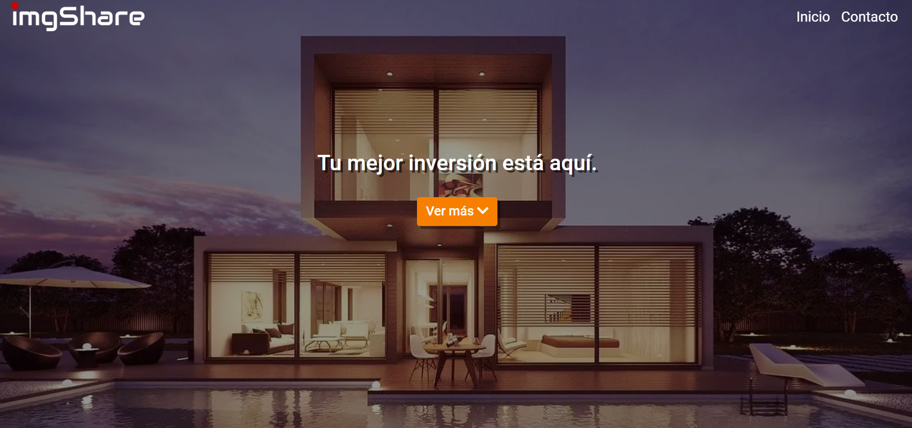
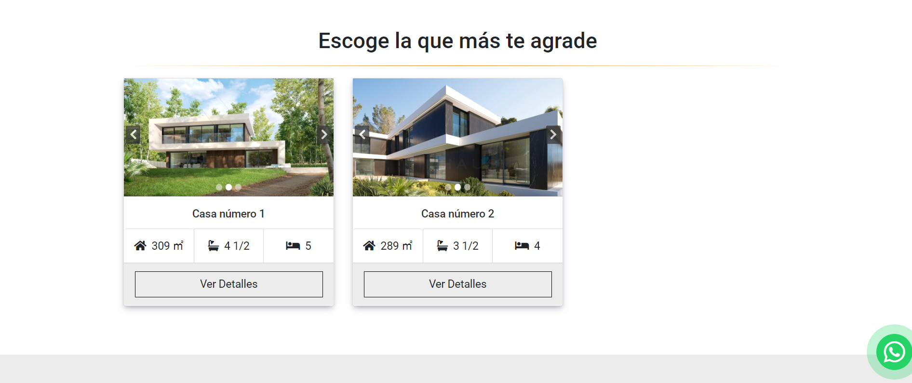
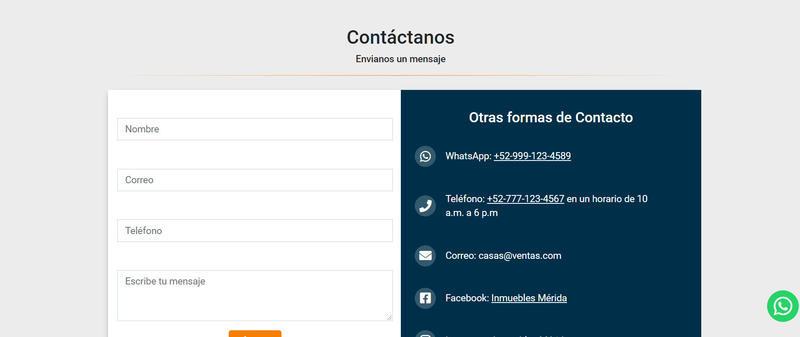
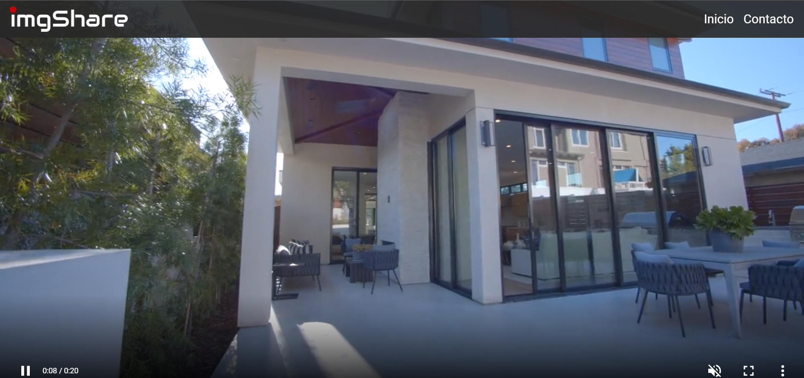
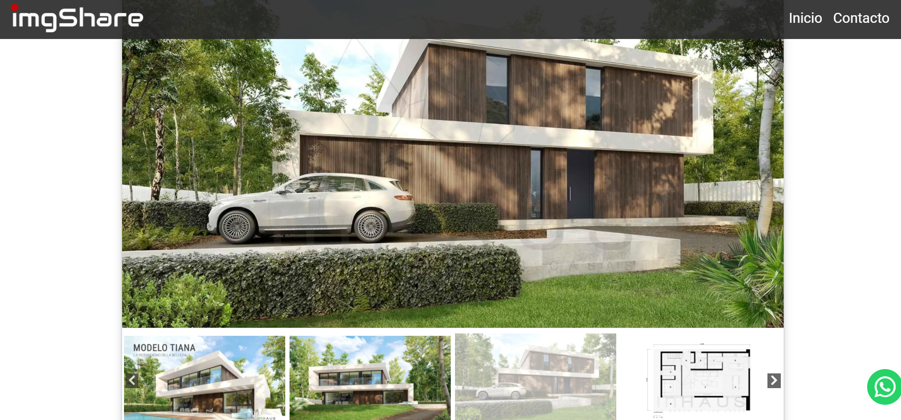
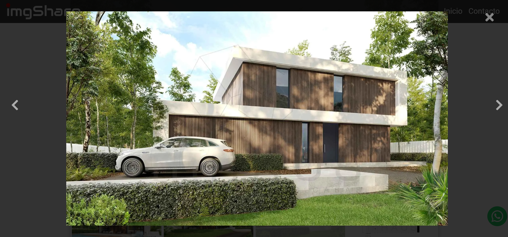
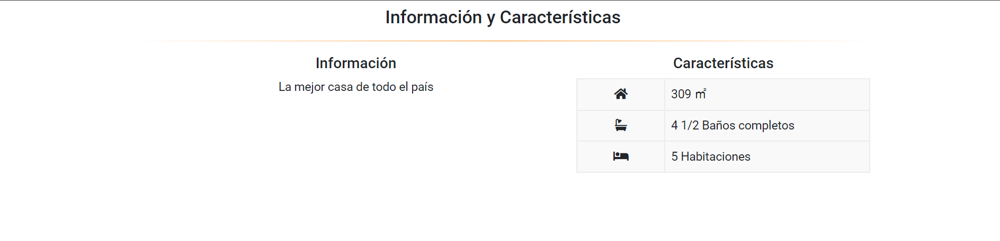
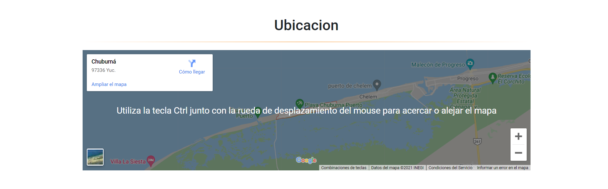

# 🏡 **House Catalog -Jehison GB**

**Little project to show some different houses**

**This Application shows a multiple houses and their info of each one. You can navigate in the page a click a house to see their details. The page has a responsive design so you can navigante in any device. The page was develop with nodeJS and handlebars to made a SSR (Server Side Rendering) page page. All the data was storage in a DB created with MySQL and the app was deployed in Heroku and the DB in Clever Cloud.**

## 💻 **Used Techonologies**

- **HTML5**
- **CSS3**
- **JavaScript (ES6)**
- **NodeJS**
- **Express.js**
- **Handlebars**
- **MySQL**

## 💻 **Installation - click here to visit the site 👉 [House-Catalog](https://catalog-prototype.herokuapp.com/)** 👈

```
🔹 git clone https://github.com/jehison98/houses-catalog.git
🔹 npm install >> ./house-catalog
🔹 npm start >> ./house-catalog
```


## 💻 **Preview**

<p>



</p>
<p>






</p>
